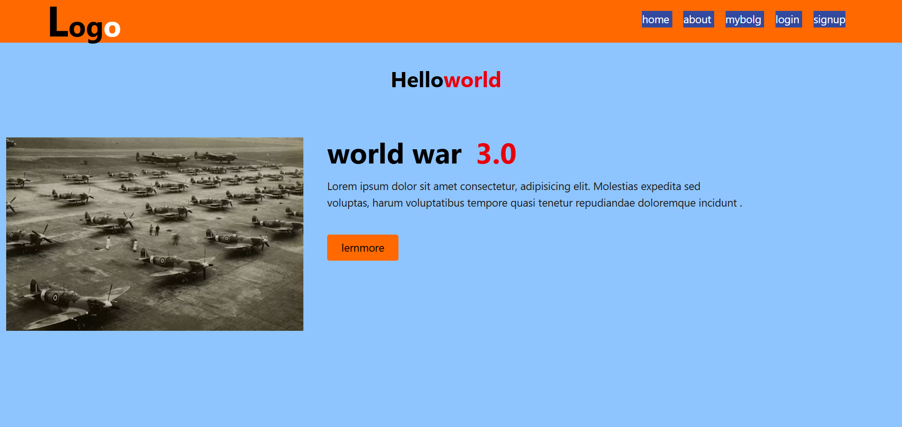

 Project Description

This project is a responsive landing page that includes:

* A dynamic navigation bar
* Responsive menu behavior
* A hero section with side-by-side layout
* Styled call-to-action button
* Mobile-first responsive design

The layout automatically adapts to different screen sizes using Tailwind’s responsive classes.

---

## 🎯 Purpose of the Project

This project was created to:

* Practice **HTML structure**
* Learn **Tailwind CSS utility classes**
* Understand **responsive design principles**
* Improve **flexbox layout skills**
* Build a clean UI without writing custom CSS

---

## 🛠️ Technologies Used

| Technology         | Purpose                    |
| ------------------ | -------------------------- |
| HTML5              | Structure of the webpage   |
| Tailwind CSS (CDN) | Styling and responsiveness |
| Font Awesome       | Icons (Hamburger menu)     |
| Unsplash           | Hero image                 |

---

## 📂 Project Structure

```
project-folder/
│
├── index.html
└── README.md
```
preview

live
[live]()




This project uses a single HTML file with CDN-based Tailwind styling.

---

## 🖥️ UI Sections Breakdown

### 🔹 1. Navigation Bar

* Logo with styled typography
* Navigation links:

  * Home
  * About
  * MyBlog
  * Login
  * Signup
* Hover effects on links
* Responsive behavior:

  * Desktop → Menu links visible
  * Mobile → Hamburger icon visible

Tailwind classes used:

* `flex`
* `justify-between`
* `items-center`
* `hidden lg:flex`
* `lg:hidden`

---

### 🔹 2. Hero Section

Includes:

* Centered main heading: **Hello World**
* Highlighted text styling using color utilities
* Responsive flex layout
* Side-by-side content on large screens
* Stacked layout on mobile devices

Flex behavior:

* `flex-col` (mobile)
* `lg:flex-row` (desktop)

---

### 🔹 3. Image Section

* Responsive image sizing
* Full width on small screens
* Fixed width on large screens
* Rounded corners
* Clean spacing using padding utilities

---

### 🔹 4. Content Section

Contains:

* Large bold heading: “World War 3.0”
* Paragraph description text
* Styled CTA button
* Hover effects on button

Button features:

* Background color
* Padding
* Rounded corners
* Hover color transition

---

## 📱 Responsive Design Strategy

This project follows a **mobile-first approach**.

Breakpoints used:

* `lg:` → Large screens
* Default classes → Mobile screens

Responsive techniques applied:

* Flex direction changes
* Conditional visibility (`hidden`, `lg:flex`)
* Responsive widths (`w-full`, `lg:w-[500px]`)
* Text scaling using breakpoint modifiers

---

## ✨ Key Tailwind Concepts Used

* Utility-first styling
* Flexbox layout system
* Spacing utilities (`px`, `py`, `gap`)
* Typography utilities (`text-xl`, `font-bold`)
* Responsive breakpoints
* Hover states
* Width control with custom values

---

## 🚀 How to Run the Project

1. Download or clone the repository
2. Open `index.html` in any browser
3. Ensure internet connection (for Tailwind & Font Awesome CDN)

No installation required.

---

## 👨‍💻 Author

**Anandhu Es**
Learning Web Development 


